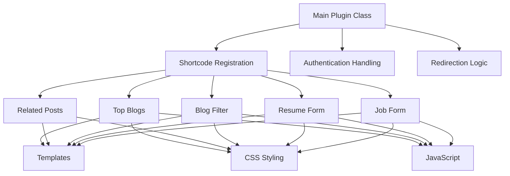
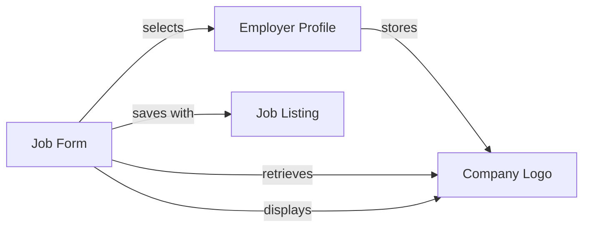
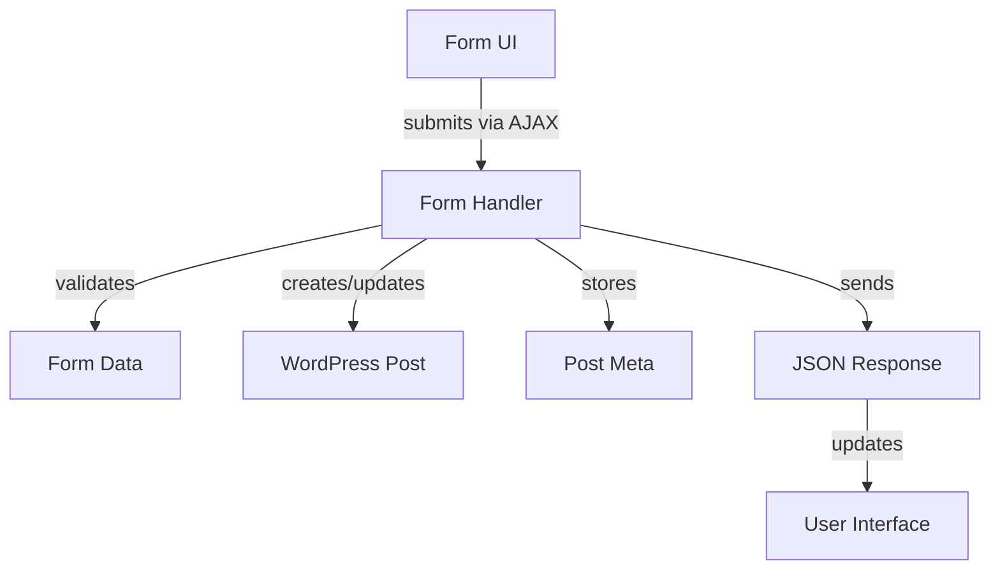

# System Patterns: Adventists Employment Plugin

## System Architecture
The Adventists Employment Plugin follows a modular WordPress plugin architecture with clear separation of concerns:

## Key Technical Decisions

### 1. Class-Based Component Structure
Each major feature is implemented as a separate PHP class:
- `JobListingForm` - Handles job posting functionality
- `ResumeForm` - Manages resume submissions
- `BlogFilter` - Controls blog content filtering
- `RelatedPosts` - Manages related content display
- `TopBlogs` - Handles featured blog content

This approach provides:
- Clear separation of concerns
- Maintainable, modular codebase
- Easy extension for new features

### 2. Shortcode Implementation
All user-facing components are implemented as WordPress shortcodes, allowing:
- Flexible placement within any WordPress page or post
- Easy integration with page builders
- Consistent rendering across the site

### 3. AJAX-Based Form Handling
Forms use AJAX for submission, providing:
- Better user experience with no page reloads
- Immediate feedback on form submission
- Improved error handling

### 4. Custom Post Types
The plugin leverages WordPress custom post types for:
- Job listings (`job_listing`)
- Employer profiles (`employer-dashboard`)
- Resume submissions

### 5. Metadata Management
Extensive use of post meta for storing:
- Job details (salary, location, etc.)
- Company information (name, website, logo)
- Application deadlines
- Custom form fields

## Component Relationships

### Logo Management Flow

### Form Submission Flow

## Design Patterns

1. **Factory Pattern**: The main plugin class acts as a factory, initializing the various component classes.

2. **Singleton Pattern**: Each component class is instantiated once and registered with WordPress hooks.

3. **Template Pattern**: Component classes define the structure while template files handle the presentation.

4. **Observer Pattern**: WordPress hooks and filters are used extensively to allow components to react to events.

5. **MVC-like Structure**:
   - Models: WordPress posts and meta data
   - Views: Template files in the templates directory
   - Controllers: PHP classes in the includes directory
